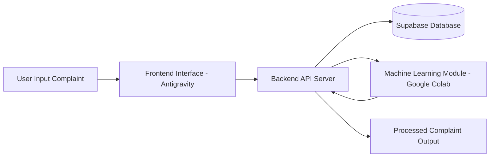

# 🧠 AI Powered Complaint Management System

An **AI-powered Complaint Management System** that allows users to submit complaints, store them securely in a cloud database, and process them using machine learning for intelligent analysis.

This system integrates **Machine Learning, Cloud Database, and Backend APIs** to build a scalable complaint management workflow.

The system enables:
- Complaint submission by users
- Secure storage of complaint data
- AI-based processing of complaints
- Structured outputs for further actions

---

# 🚀 Project Overview

This project is divided into **three main components**:

### 1️⃣ Machine Learning Module
Processes complaint text and performs intelligent analysis.

### 2️⃣ Backend System
Handles API communication between frontend and database.

### 3️⃣ Cloud Database
Stores complaint data securely using Supabase.

---

# 🛠 Tech Stack

### Programming & ML


### Machine Learning Environment


### Backend / Frontend Platform


### Cloud Database


### API Integration


---

# 🏗 System Architecture



### Architecture Explanation

1️⃣ User submits complaint through the **Frontend Interface**

2️⃣ Backend API receives the request

3️⃣ Complaint is stored in **Supabase Database**

4️⃣ Machine Learning module processes the complaint text

5️⃣ Backend returns the processed output

---

# 📂 Project Structure

```
AI-Complaint-System
│
├── database
│   └── supabase_schema.sql
│
├── machine-learning
│   └── complaint_model_colab.ipynb
│
├── backend
│   └── backend_api_code
│
├── frontend
│   └── antigravity_ui_code
│
└── README.md
```

---

# ⚙️ Features

✔ Complaint submission system  
✔ Cloud-based complaint storage  
✔ AI-based complaint processing  
✔ Backend API integration  
✔ Modular and scalable architecture

---

# 🧩 System Workflow

### Step 1 — Complaint Input

User enters:

```
Name
Email
Complaint
```

Example:

```
Name: Rohit Sharma
Email: rohit@gmail.com
Complaint: Fan not working
```

---

### Step 2 — Backend Processing

Backend performs:

- Input validation
- API handling
- Database communication

---

### Step 3 — Database Storage

Complaint is stored in Supabase table.

Example table:

| ID | User Name | Email | Complaint |
|----|-----------|-------|----------|
| 1 | Rohit Sharma | rohit@gmail.com | Fan not working |

---

### Step 4 — AI Processing

Machine Learning model analyzes complaint text for:

- complaint understanding
- intelligent analysis
- future automation capabilities

---

# 🔑 Required API Keys

The project requires the following keys:

### Supabase

```
SUPABASE_URL
SUPABASE_API_KEY
```

Used for database connection.

---

### Google API Key

```
GOOGLE_API_KEY
```

Used for AI / ML integration.

⚠️ **Important:**  
Do not expose API keys publicly in GitHub repositories.

Use environment variables instead.

---

# 💻 Installation and Setup

### 1️⃣ Clone the repository

```bash
git clone https://github.com/yourusername/ai-complaint-system.git
```

---

### 2️⃣ Install dependencies

```bash
pip install supabase
pip install google-generativeai
```

---

### 3️⃣ Configure Environment Variables

Create a `.env` file:

```
SUPABASE_URL=your_supabase_url
SUPABASE_API_KEY=your_supabase_api_key
GOOGLE_API_KEY=your_google_api_key
```

---

### 4️⃣ Run Machine Learning Module

Open the notebook:

```
machine-learning/complaint_model_colab.ipynb
```

Run it in **Google Colab**.

---

# 📊 Future Improvements

Possible enhancements:

- RAG based complaint understanding
- Automatic complaint categorization
- Sentiment analysis
- Complaint priority detection
- Admin dashboard
- Complaint analytics visualization

---

# 🤝 Contributors

This project was developed collaboratively.

### Machine Learning Developer
Developed ML model and complaint analysis

### Backend Developer
Implemented API and backend logic

### Database Engineer
Designed Supabase database and schema

---

# ⭐ Support

If you found this project useful, consider giving it a ⭐ on GitHub.

It helps others discover the project.
